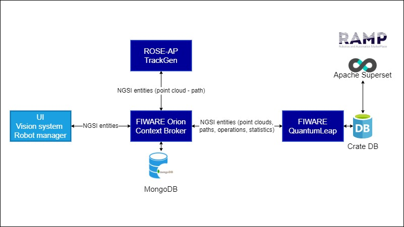

# Agile Robotized Processing (ARP)

This project is part of [DIH^2](http://www.dih-squared.eu/). For more information check the RAMP Catalogue entry for the components.
This repository contains the ROSE-AP component (TrackGen) and other components developed for the TTE.

| :books: [Documentation](https://arp.readthedocs.io/en/latest) |
| --------------------------------------------- | 

## Background

### Application Domain

Sanding of wooden panels for the furniture industry.

### Use Case Needs / Agility Challenge Description

Use Case Needs: Panels in different shapes and sizes need to be processed from the top and from the sides as part of preparation 
of the surface for different types of finish. An example of custom shape wood panel is provided in the following image.

Processing is done manually due to lack of flexible solutions which can easily adapt to frequently changing production in a user friendly way.

The challenges for the company originate mainly from two sources: the increased demand and unpredictability of their production. 
Different workers require different processing times depending on their skill and experience, and inconsistencies in production 
quality mean that sometimes a workpiece may even be returned for corrective re-processing to ensure that the quality of the
finished product is not compromised.

The challenges for the company originate mainly from two sources: the increased demand and unpredictability of their production. 
Different workers require different processing times depending on their skill and experience, and inconsistencies in production 
quality mean that sometimes a workpiece may even be returned for corrective re-processing to ensure that the quality of the
finished product is not compromised.

### Main Objectives

The proposed solution aims to achieve high flexibility for automating the processing of flat workpieces.
In order to achieve this goal, the system has been designed to manage different parameters of the sanding process,
which are not tied to a particular model or brand.
Workers will be able to choose the correct combination of parameters (speed of the movement, sander diameter, overlap 
percentage) for a certain type of material in relation to the desired finish and, based on that, the system will automatically 
configure itself.

### Solution workflow

The proposed solution does not contain the vision system, necessary to acquire images and process them to obtain point clouds.
This is convenient because the system is not tied to 2D cameras from a particular vendor.

The basic workflow of the solution is the following:

- install the FIWARE environment contained in this repository ([Installation guide](installationguide.md));

- define the two required FIWARE subscriptions on the Orion context broker (TrackGen should be subscribed to new PointCloud
  entities, while the target application to the new Measurement entities), as defined in the [User Manual](usermanual.md).
  Other useful subscriptions are reported in the [API](api.md) and allow the user to update the sanding parameters. 

- acquire a 2D image and generate a point cloud. In order to generate a good image and then valid point cloud, the user should:

    1. put a light above (and/or under) the object to make it clearly distinguishable from the background in the 2D image.
    
    2. remove noise (objects that should not be sanded) from the 2D grayscale image, then threshold it. 
       Background points should have low values, i.e. less than the threshold value of -100 (in the robot coordinate system), 
       while part to be sanded should have values higher of the threshold (the height of the object in the robot coordinate
       system). 
    
    3. sample the image with fixed step in both axes to obtain a point cloud. During this step, each point of the image 
       should be mapped in the coordinate system of the robot, i.e. the point in top-left corner of the image, with x=0,
       y=0 and z=20, becomes x=x', y=y', z=20.
    
- encode the point cloud in a NGSI PointCloud entity and send it to the Orion context broker.

- the ROSE-AP component will receive the data forwarded from the Orion context broker. 

- the ROSE-AP will generate the path to process the part, then will encode it in a NGSI Measurement entity and send to 
  the Orion context broker.

- finally, the target application will receive the resulting path, delivered by the Orion context broker. The Orion CB 
  can be configured also to send the NGSI entities to the cloud infrastructure provided by this solution, in order to
  make it possible to monitor operations remotely.  

Thanks to this approach, our solution is completely indipendent of hardware, both models and brands of robots and cameras, 
but it is still highly configurable because all sanding parameters (speed of the movement, sander diameter, overlap 
percentage) can be updated for each new part through the FIWARE subscriptions.

Example for creating subscriptions is provided in [subscriptions.py](../src/utils/subscriptions.py), while 
[simple_vision_system.py](../src/utils/simple_vision_system.py) can be used to simulate the generation of entities (even 
PointCloud entities) and their communication to the Orion Context Broker. A point cloud example (it is parsed in the 
[PointCloud Python class](../src/entities/point_cloud.py)) can be found at this [link](../src/assets/raw_point_cloud.txt).

## Architecture

The architecture consists of the following components:

 - the ROSE-AP application, called TrackGen, which is a Flask application that processes point clouds - the "PointCloud" NGSI entities - 
   extracted in an intelligent way by the vision system and computes paths - the "Measurement" NGSI entities - for the target application.

 - a local instance of FIWARE Orion Context Broker, which is ready and runs in the plant. It is the main connector of the 
   architecture and receives all NGSI entites. The database MongoDB stores the NGSI entities that come from the context broker.

 - a local instance of FIWARE QuantumLeap as historical data connector, it receives IoT data as entities forwarded by the context broker 
   on port 8668.
 
 - an instance of the CrateDB database, a local data historian, listening on port 4200, stores data coming from QuantumLeap as time-series, 
   which are useful for visualization on web dashboards. Daily data from QuantumLeap will be collected by Crate DB, so users can remotely monitor efficiency of the machine on the ramp.eu dashboard. Data is composed of overall metrics, like KPI scores, and raw data, like number of completed parts, real and estimated time to complete parts and estimated paths.

Additional components are:

 - a vision system, which acquires images 2D camera, generates point clouds from images, handles communication with PLC and robot 
   and executes the production cycle. This component creates NGSI entities from the IoT devices it is connected to and from ongoing operations.  

 - a PLC that commands a conveyor belt.

 - a robot that executes the sanding.
 
In figure, the software components of the system.

## Install

Information about how to install the ARP ROSE-AP can be found in the [Installation Guide](installationguide.md).

## Usage

Information about how to use the component can be found in the [User Manual](usermanual.md).

## License

[Apache2.0](../LICENSE) © 2023 Vision Equipment 
