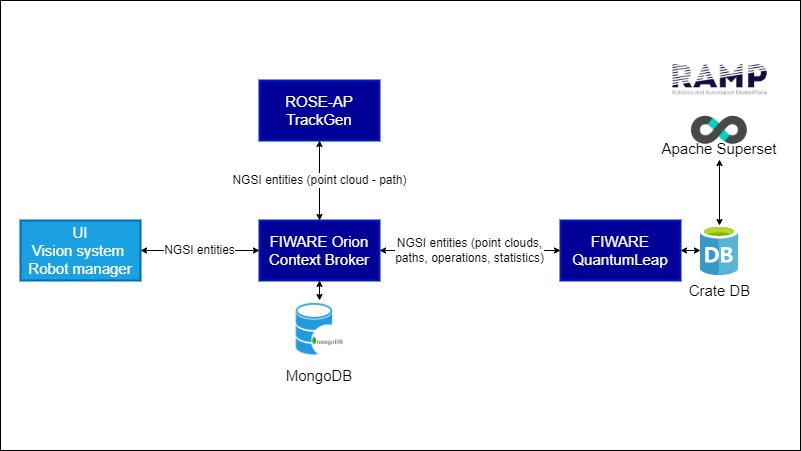

# Architecture

The solution consists of the following components:

 - the ROSE-AP application, called TrackGen, which is a Flask application that processes point clouds - the "PointCloud" NGSI entities - 
   extracted in an intelligent way by the vision system and computes paths - the "Measurement" NGSI entities - for the target application.

 - a local instance of FIWARE Orion Context Broker, which is ready and runs in the plant. It is the main connector of the 
   architecture and receives all NGSI entites. The database MongoDB stores the NGSI entities that come from the context broker.

 - a local instance of FIWARE QuantumLeap as historical data connector, it receives IoT data as entities forwarded by the context broker 
   on port 8668.
 
 - an instance of the CrateDB database, a local data historian, listening on port 4200, stores data coming from QuantumLeap as time-series, 
   which are useful for visualization on web dashboards. Daily data from QuantumLeap will be collected by Crate DB, so users can remotely monitor efficiency of the machine on the ramp.eu dashboard. Data is composed of overall metrics, like KPI scores, and raw data, like number of completed parts, real and estimated time to complete parts and estimated paths.

Additional components are:

 - a vision system, which acquires images from a 2D camera, generates point clouds from images, handles communication with PLC and robot 
   and executes the production cycle. This component creates NGSI entities from the IoT devices it is connected to and from ongoing operations.  

 - a PLC that commands a conveyor belt.

 - a robot that executes the sanding.
 
In figure, the software components of the system.

In this repository, you can find the ROSE-AP code, the Docker Compose YAML file to reproduce the FIWARE environment
 and a simulated vision system, to test the component. PLC and robot software is not provided.
